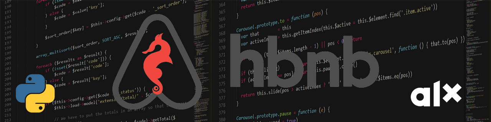

# AirBnB_clone



## Description
This is the console part of the Airbnb clone project for ALX Africa. It allows us to manage objects through the command line, retrieve objects from a file, and store objects in that file. This is a project to learn and understand how a command interpreter works and how to use it to build a functional Airbnb clone.

## The Command Interpreter
The command interpreter provides a way for the user to interact with the objects. The console provides the following functionalities:

## Getting Started
### Prerequisites
To run this program, you need to have the following:

- Python 3 installed on your machine
- A code editor or IDE (Integrated Development Environment) such as PyCharm, Visual Studio Code, Sublime Text, or any other text editor
- The following modules installed: `cmd`, `json`, `os`, `datetime`
- You can install the `cmd` module using `pip`, which is the package installer for Python. The `json`, `os`, and `datetime` modules are built-in and come pre-installed with Python 3.

### Installing
You can download the source code of this project by running the following command:
```
git clone https://github.com/MelakuDemeke/AirBnB_clone.git
```
## Commands

## Usage

## Files

## contributors
<a href="https://github.com/MelakuDemeke/AirBnB_clone/graphs/contributors">
  
</a>
